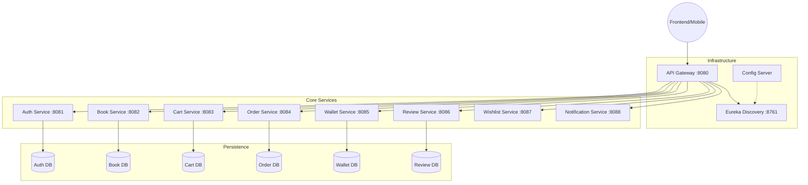

# ⚙️ BookNest Backend — Scalable Microservices System

<p align="center">
  <a href="https://www.java.com/" target="_blank">
    
  </a>

  <a href="https://spring.io/" target="_blank">
    
  </a>

  <a href="https://www.mysql.com/" target="_blank">
    
  </a>
</p>
<p align="center">
  <b>A production-ready backend built using Microservices Architecture for scalable and secure book commerce.</b>
</p>

---

## ✨ Overview

**BookNest Backend** is a **distributed microservices system** designed for scalability, fault tolerance, and high performance.  
It powers the BookNest ecosystem by handling **authentication, catalog management, orders, payments, and notifications**.

---

## 🏗️ System Architecture

BookNest follows a distributed microservices pattern with a centralized API Gateway and Service Discovery.



---

## 🛠️ Service Catalog

| Service | Port | Responsibility |
| :--- | :---: | :--- |
| **Eureka Server** | `8761` | Service registration and discovery hub. |
| **API Gateway** | `8080` | Entry point, routing, and security enforcement. |
| **Auth Service** | `8081` | User registration, authentication, and JWT issuance. |
| **Book Service** | `8082` | Catalog management, book inventory, and search. |
| **Cart Service** | `8083` | Shopping cart persistence and management. |
| **Order Service** | `8084` | Checkout processing, order history, and status tracking. |
| **Wallet Service** | `8085` | User balance, transactions, and payment processing. |
| **Review Service** | `8086` | Ratings, comments, and book feedback management. |
| **Wishlist Service**| `8087` | Personal user wishlists and saved items. |
| **Notification** | `8088` | System alerts and user notifications. |

---

## 🚀 Technologies & Tools

### 🧩 Core Backend
- **Framework:** Spring Boot 3.x
- **Microservices:** Spring Cloud (Netflix Eureka, API Gateway)
- **Security:** Spring Security, JWT Authentication, OAuth 2.0
- **Database:** MySQL 8.x (Database-per-service pattern)
- **ORM:** Spring Data JPA (Hibernate)
- **Build Tool:** Maven

---

### 🧱 Infrastructure & DevOps
- 🐳 Docker — Containerized microservices deployment for consistent environments  
- 📨 RabbitMQ — Asynchronous messaging for inter-service communication  

---

### 🔐 Authentication & Payments
- 🔑 OAuth 2.0 (Google Login) — Secure social authentication  
- 💳 Razorpay — Payment gateway integration for transactions  

---

### 🧪 Testing & Code Quality
- 🧪 Mockito — Unit testing and service mocking  
- 📊 SonarQube / SonarLint — Static code analysis and quality assurance  

---

### 📄 API & Documentation
- 📘 Swagger / OpenAPI — API documentation and testing
- 📬 Postman — API testing, request validation, and workflow automation

## 🚦 Getting Started

### Prerequisites
- JDK 17 or higher
- MySQL Server 8.x
- Maven 3.8+

### Installation & Setup

1. **Clone the repository:**
   ```bash
   git clone https://github.com/your-repo/booknest.git
   cd booknest/Backend
   ```

2. **Database Configuration:**
   - You can use the provided [BookNestDB.sql](./BookNestDB.sql) script to quickly create all required databases:
     ```bash
     mysql -u root -p < BookNestDB.sql
     ```
   - Alternatively, manually create: `booknest_auth`, `booknest_book`, `booknest_cart`, `booknest_order`, `booknest_wallet`, `booknest_review`, `booknest_wishlist`, `booknest_notification`.
   - Update `application.properties` in each service with your MySQL credentials.

3. **Build the project:**
   ```bash
   mvn clean install
   ```

4. **Run Order (Sequence is Important!):**
   1. `eureka-server` (Wait for it to start)
   2. `api-gateway`
   3. All other microservices.

---

## 🔐 Security Workflow

BookNest uses a stateless JWT-based security model:
1. User logs in via `auth-service`.
2. `auth-service` validates credentials and returns a signed **JWT Token**.
3. Client includes this token in the `Authorization: Bearer <token>` header for all subsequent requests.
4. `api-gateway` intercepts the request, validates the token, and extracts user details before routing to downstream services.

---

## 📈 Key Features

- ✅ **Distributed Architecture:** Each service is independently deployable.
- ✅ **Fault Tolerance:** If one service goes down, the rest of the system stays alive.
- ✅ **Secure by Design:** Centralized security at the Gateway level.
- ✅ **Asynchronous Communication:** Notification service handles background alerts.
- ✅ **Data Integrity:** Transactional consistency across order and wallet operations.

---

<p align="center">
  Made with ❤️ by <b>Ritesh Thakre</b> <br/>
  🔗 GitHub: <a href="https://github.com/Ritesh-Kumar-Thakre">Ritesh Thakre GitHub</a> |
  💼 LinkedIn: <a href="www.linkedin.com/in/ritesh-thakre">Ritesh Thakre linkedin</a>
</p>
